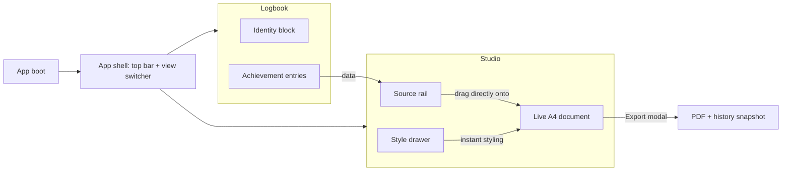

# AchieveMate — Design System & PRD Specification

**Codename: "The Chart Room"**
Version 1.0 — Design authority document. Implementations must follow the exact values in this file. Where a value is not specified, use the nearest token from Part 2; never invent new colors, sizes, or timings.

**How to read this document**

- All colors are given as hex or `rgba()`. All of them exist as CSS custom properties defined in §2.6 — components reference tokens, never raw values.
- Measurements are in `px` for precision; a `rem` equivalent is given where type is involved (root = 16px).
- Every component spec includes: anatomy (DOM structure), box measurements, typography, colors per state, and motion.
- Tailwind-equivalent utility strings are provided as `tw:` lines for teams using Tailwind; they use arbitrary values (`bg-[#0B1524]`) so they work without a config, but a `tailwind.config` theme extension is included in §2.7.
- "Old" refers to the current implementation (`index.html`, `styles.css`, `app.js`, `cv-builder.js`, `cv-preview.js`, `cv-layout-panel.js`, `workspace-tabs.js`, `parallax.js`).

---

# Part 1 — Design Audit & Executive Critique

## 1.1 The three structural sins

**Sin 1 — The CV exists in three places at once.**
The block canvas (`cv-builder.js`) is an abstract list of cards. The preview (`cv-preview.js`) is a *second*, fully editable WYSIWYG document. The Layout & Style drawer is a third control surface acting on the second. The user composes blind in the "CV Builder" tab, switches tabs to discover what it actually produced, edits it inline there, and is then offered a "Refresh" button whose job is to *destroy those inline edits* to re-sync the two competing sources of truth. This is the root cause of the app feeling disjointed. The fix is architectural, not cosmetic: **there is exactly one CV — the live A4 document — and everything drags onto it directly.**

**Sin 2 — The boat is the front door.**
The parallax landing (`parallax.js`, the `.scene` layer stack) is charming exactly once. A hidden click target (the boat) is the *only* entry point, it blocks every visit, and the 1.4s crossfade is a toll booth in front of a productivity tool. Delight that costs a mandatory click per session curdles into friction by day three. The low-poly ocean identity is worth keeping — as ambience behind the workspace, not as a gate in front of it.

**Sin 3 — Identity soup.**
Four tabs get four different accent colors (sky `#38BDF8`, yellow `#FACC15`, green `#34D399`, purple `#A78BFA`) — a rainbow is the absence of a decision. Every container is the same recipe (translucent navy + `backdrop-blur` + 1px cyan border + radius) nested 3–4 levels deep (`journal-card > panel > panel-inset > achievement-card`). Uppercase micro-labels appear at five different sizes. There are three visually distinct dashed-border empty states. The whole reads as "dark template," not "crafted instrument."

## 1.2 CUT

| Item | Where it lives today | Why it dies |
|---|---|---|
| Blocking landing scene + boat entry | `.scene` markup in `index.html` (lines 10–31), `parallax.js`, `styles.css` §1 | Mandatory click + 1.4s fade on every visit. App boots directly into the workspace. |
| Parallax pointer tracking, `boatBob`, `cloudDrift` keyframes | `parallax.js`, `styles.css` | Continuous rAF loop + infinite animations for a screen that no longer exists. |
| CV Builder tab (abstract block canvas) | `#tab-cv-builder`, `cv-builder.js` canvas rendering | Redundant middle representation. Drag sources remain; the drop target becomes the live document itself (§3.4). |
| "Education" panel on Profile | `index.html` lines 136–148 | A paragraph telling the user to go use a different tab is a dead end, not a feature. |
| Four-color tab accent system | `.journal-bookmark[data-tab]::after` rules | One accent (Brass, §2.2). Full stop. |
| `window.prompt` / `window.alert` / `window.confirm` | `cv-preview.js` (`promptFileName`, `exportPdf`, `refreshFromCanvas`) | Native dialogs shatter the visual world. Replaced by the Export modal (§4.4) and toasts (§4.3). |
| "Refresh preview" destructive rebuild button | `#refreshPreviewBtn` | Exists only to reconcile the dual-source-of-truth bug. With one document, there is nothing to reconcile. |
| "Achievement N" ordinal card titles | `createAchievementCard` in `app.js` | Entries are identified by their own titles. Numbering is developer bookkeeping leaking into UI. |
| One layer of container nesting | `.panel` + `.panel-inset` double-wrap | Max container depth is 2: view surface → entry card. |
| Gradient text on the app title | `.app-title` background-clip | Gradient text is the single fastest "vibe-coded" tell. Wordmark is set in Fraunces, solid `--text-primary`. |
| Per-tab bookmark "meta" sublabels | `.journal-bookmark-meta` | Two views with clear names don't need subtitles. |

**Assets no longer referenced after this spec:** `sky.png`, `clouds.png`, `mountain_left.png`, `mountain_right.png`, `boat.png`, `designpage.png`. Keep `ocean_dark_background.png` (workspace ambience, §2.5) and `logo.png` (top bar).

## 1.3 KEEP

| Item | Where | Why |
|---|---|---|
| Auto-fit single-page binary search | `applySmartLayout` in `cv-preview.js` | Genuinely good engineering. Promoted from invisible magic to a visible instrument: the Density gauge (§3.4.3). |
| Inline `contenteditable` editing on the document | `cv-preview.js` | Editing the artifact directly is the correct model — it becomes the *primary* model, not a secondary one. |
| `localStorage` persistence + edit overlay (`cvPreviewEdits`) | `app.js`, `cv-preview.js` | Sound. Surfaced to the user via the Saved indicator (§3.2.4). |
| Export history with snapshots | `cv-preview.js` | Useful safety net. Relocated into the Studio drawer (§3.4.5). |
| Keyboard-accessible tab pattern (roving tabindex, arrow keys) | `workspace-tabs.js` | Correct ARIA work; reuse the logic for the 2-view switcher. |
| Zoom system (fit-scale × user-zoom, Ctrl+wheel) | `cv-preview.js` | Works well. Restyled per §3.4.2. |
| The logbook → compose mental model | Whole app | The product's soul. The overhaul strengthens it: log in the Logbook, compose in the Studio. |
| Low-poly ocean artwork | `ocean_dark_background.png` | The one distinctive brand asset. Becomes ambience under a darkening scrim (§2.5). |

## 1.4 REFACTOR

| Item | From → To |
|---|---|
| Navigation | 4 tabs (Profile / Logbook / CV Builder / Preview) → **2 views**: **Logbook** (identity block + entries) and **Studio** (rail + live document + style drawer). The `preview-stage-active` body-class hack that hides the header and re-pins bookmarks is deleted; the Studio *is* the stage. |
| Profile tab | → Identity block at the top of the Logbook (§3.3.2). Three fields do not deserve a navigation destination. |
| Achievement cards | Always-open edit forms → display-mode entries with explicit edit-in-place state (§3.3.3). Kills the wall-of-inputs fatigue. |
| Style panel | 12 controls in one scroll → grouped controls with live mono value chips, segmented controls replacing radio stacks (§3.4.4). |
| Drag & drop | Card-highlight drop targeting → a single brass insertion line between document sections (§4.2). |
| Empty states | 3 inconsistent dashed boxes → 1 designed pattern, 3 instances (§4.5). |
| Feedback | Silent saves, native alerts → toast system + Saved indicator (§4.3, §3.2.4). |

---

# Part 2 — Brand Book: "The Chart Room"

## 2.1 Core concept

Not a boat ride — **a navigator's chart room**. The place where the voyage is *planned*: dark timber, deep ink, brass instruments, and one white chart under the lamp. Translated to UI law:

1. **The document is the light source.** The white A4 sheet is the single brightest object in the app. Every chrome surface stays at least 3 elevation steps darker. Nothing else may be pure white.
2. **One brass accent.** Interactive/active/dragging = Brass. There is no second accent. Green and red exist only as status signals, never as decoration.
3. **Instruments, not decorations.** Every animated or glowing element must communicate state (drag position, save status, fit density). If it moves and means nothing, it is cut.
4. **Ink discipline.** Surfaces are near-opaque. `backdrop-filter: blur()` is permitted on exactly three elements: the modal overlay, toasts, and the drag ghost. Nowhere else.

## 2.2 Color palette

Root background sits under everything (§2.5). All UI chrome uses Surface/Border/Text tokens; the document uses Document tokens.

| Token | Hex / Value | Role |
|---|---|---|
| `--abyss` | `#060D18` | Page background base; scrim color over the ocean artwork. |
| `--surface-1` | `#0B1524` | Primary panel background: cards, rail, drawer, top bar. |
| `--surface-2` | `#101C2E` | Nested/interactive surfaces: inputs, draggable blocks, toasts, segmented tracks. |
| `--surface-3` | `#16243A` | Highest chrome elevation: hover fills, active segment cells, slider tracks, modal panel. |
| `--border-subtle` | `#1D2E45` | Default 1px border for every surface. |
| `--border-strong` | `#2C425F` | Hover borders, modal border, dividers that must read at a glance. |
| `--text-primary` | `#EDF3F8` | Headings, input values, entry titles. |
| `--text-secondary` | `#9FB2C4` | Body copy, descriptions, inactive nav items. |
| `--text-muted` | `#5D7189` | Placeholders, captions, timestamps, disabled text. |
| `--brass` | `#E8B45A` | THE accent: primary buttons, active states, focus rings, insertion line, slider fills, links. |
| `--brass-bright` | `#F2C878` | Hover state of any brass element. |
| `--brass-tint` | `rgba(232, 180, 90, 0.12)` | Brass-tinted fills: active nav pill glow, drop-flash, empty-state glyph circle. |
| `--brass-ring` | `rgba(232, 180, 90, 0.35)` | 3px outer glow on focused inputs. |
| `--ink-on-brass` | `#1A1205` | Text/icons on brass backgrounds. Never use white on brass. |
| `--signal-success` | `#4ADE80` | Success toasts, Saved indicator dot. |
| `--signal-danger` | `#F87171` | Destructive buttons/text. |
| `--danger-tint` | `rgba(248, 113, 113, 0.12)` | Destructive hover fill. |
| `--doc-paper` | `#FFFFFF` | The A4 document only. |
| `--doc-ink` | `#111111` | Default document text (user-overridable in drawer). |
| `--scrim-overlay` | `rgba(6, 13, 24, 0.72)` | Modal overlay color (with 8px blur). |

**Hard rules**
- The cyan family (`#38BDF8`, `#7DD3FC`, `#BAE6FD`…) from the old build is **retired everywhere**.
- Brass never appears at more than one intensity per component (e.g. a button is brass; its icon is `--ink-on-brass`, not brass-bright).
- No gradients anywhere in chrome. The only permitted gradient is the background scrim (§2.5).

## 2.3 Typography

**Families** (load once in `<head>`; `display=swap`):

```html
<link rel="preconnect" href="https://fonts.googleapis.com" />
<link rel="preconnect" href="https://fonts.gstatic.com" crossorigin />
<link
  href="https://fonts.googleapis.com/css2?family=Fraunces:opsz,wght@9..144,500;9..144,600&family=Inter:wght@400;500;600&family=JetBrains+Mono:wght@400;500&display=swap"
  rel="stylesheet"
/>
```

- **Fraunces** — display serif. The "logbook voice". View titles, entry titles, modal titles, empty-state headlines. Never for buttons, labels, or body copy.
- **Inter** — all UI text: body, buttons, inputs, captions, labels.
- **JetBrains Mono** — data: dates, zoom %, slider values, filenames, counters. Always with `font-variant-numeric: tabular-nums`.
- The **document** keeps its user-selected print stack (Times New Roman / Arial / Calibri / Garamond) — the CV is an artifact for recruiters, not part of the app's brand.

**Type scale** (root 16px; sizes in rem with px equivalent):

| Style token | Family / Weight | Size | Line-height | Letter-spacing | Usage |
|---|---|---|---|---|---|
| `display` | Fraunces 600 | 1.75rem / 28px | 1.2 | -0.01em | View titles ("Logbook", "Studio") |
| `title` | Fraunces 600 | 1.125rem / 18px | 1.3 | -0.005em | Entry titles, modal title, drawer title |
| `title-sm` | Fraunces 500 | 1rem / 16px | 1.35 | 0 | Empty-state headlines |
| `ui` | Inter 500 | 0.9375rem / 15px | 1.4 | -0.01em | Buttons, input values, nav items |
| `body` | Inter 400 | 0.875rem / 14px | 1.55 | 0 | Descriptions, bullets, helper prose |
| `caption` | Inter 500 | 0.75rem / 12px | 1.4 | 0.01em | Meta text, timestamps, hints |
| `label` | Inter 600 | 0.6875rem / 11px | 1.3 | 0.08em, uppercase | Field labels, drawer group headers. The ONLY uppercase style. |
| `mono` | JetBrains Mono 500 | 0.8125rem / 13px | 1.4 | 0 | Dates, values, zoom % |
| `mono-sm` | JetBrains Mono 400 | 0.75rem / 12px | 1.4 | 0 | Chips, filenames, counters |

`tw:` equivalents — `display` = `font-fraunces font-semibold text-[1.75rem] leading-[1.2] tracking-[-0.01em]`; `label` = `font-inter font-semibold text-[0.6875rem] leading-[1.3] tracking-[0.08em] uppercase`; `mono` = `font-jetbrains font-medium text-[0.8125rem] tabular-nums`.

## 2.4 Space, radius, borders, shadows, motion

**Spacing scale** (only these values): `4, 8, 12, 16, 20, 24, 32, 40, 48, 64` px.

**Radii:**

| Token | Value | Usage |
|---|---|---|
| `--radius-sm` | 6px | Chips, segmented cells, small icon buttons |
| `--radius-md` | 10px | Buttons, inputs, draggable blocks, toasts |
| `--radius-lg` | 16px | Cards, drawer groups, modal panel |
| `--radius-full` | 999px | Nav pill, Saved indicator, slider thumb |

**Borders:** every surface gets exactly one `1px solid var(--border-subtle)` border. Hover promotes to `--border-strong`; active/focus promotes to `--brass`. Never 2px borders (focus uses outline instead, §2.4 Focus).

**Shadows** (elevation must be real — a shadow implies the element floats):

| Token | Value | Usage |
|---|---|---|
| `--shadow-raised` | `0 1px 2px rgba(0,0,0,0.4), 0 4px 12px rgba(0,0,0,0.25)` | Hovered cards/blocks |
| `--shadow-overlay` | `0 2px 8px rgba(0,0,0,0.35), 0 8px 24px rgba(0,0,0,0.45)` | Modal, toasts, history popover |
| `--shadow-drag` | `0 12px 32px rgba(0,0,0,0.5)` | Drag ghost |
| `--shadow-document` | `0 0 0 1px rgba(255,255,255,0.06), 0 24px 64px rgba(0,0,0,0.55)` | The A4 sheet |

Flat-at-rest rule: cards, rail, drawer, and top bar have **no shadow at rest**.

**Motion:**

| Token | Value | Usage |
|---|---|---|
| `--ease-out` | `cubic-bezier(0.22, 1, 0.36, 1)` | Everything entering/settling |
| `--ease-in-out` | `cubic-bezier(0.65, 0, 0.35, 1)` | Drawer collapse, layout shifts |
| `--dur-fast` | 120ms | Color/border/opacity changes |
| `--dur-base` | 180ms | Transforms, hovers, toast enter |
| `--dur-slow` | 260ms | Drawer collapse, modal enter, view switch |

Never animate `width`/`height`/`margin` except the drawer collapse. Honor `prefers-reduced-motion: reduce` by dropping all transforms (opacity-only transitions).

**Focus:** every interactive element: `outline: 2px solid var(--brass); outline-offset: 2px;` on `:focus-visible` only. Inputs additionally get `border-color: var(--brass); box-shadow: 0 0 0 3px var(--brass-ring);` on `:focus`.

**Hover ("lantern" treatment):** interactive surfaces never translate on hover. Instead: border → `--border-strong`, background → one surface step up, plus `--shadow-raised` where the element is pickable (draggable blocks, entries). Duration `--dur-fast`.

## 2.5 The background (ocean, demoted to ambience)

```css
body {
  background: var(--abyss);
}
body::before {
  content: "";
  position: fixed;
  inset: 0;
  z-index: 0;
  background: url("ocean_dark_background.png") center / cover no-repeat;
  opacity: 0.4;
}
body::after {
  content: "";
  position: fixed;
  inset: 0;
  z-index: 0;
  background: linear-gradient(180deg, rgba(6, 13, 24, 0.78) 0%, rgba(6, 13, 24, 0.92) 100%);
}
```

Static. No parallax, no pointer tracking, no drift. The texture should be *felt*, not watched. All app content sits on `z-index: 1+`.

## 2.6 Token sheet (copy verbatim)

```css
:root {
  /* color */
  --abyss: #060D18;
  --surface-1: #0B1524;
  --surface-2: #101C2E;
  --surface-3: #16243A;
  --border-subtle: #1D2E45;
  --border-strong: #2C425F;
  --text-primary: #EDF3F8;
  --text-secondary: #9FB2C4;
  --text-muted: #5D7189;
  --brass: #E8B45A;
  --brass-bright: #F2C878;
  --brass-tint: rgba(232, 180, 90, 0.12);
  --brass-ring: rgba(232, 180, 90, 0.35);
  --ink-on-brass: #1A1205;
  --signal-success: #4ADE80;
  --signal-danger: #F87171;
  --danger-tint: rgba(248, 113, 113, 0.12);
  --doc-paper: #FFFFFF;
  --doc-ink: #111111;
  --scrim-overlay: rgba(6, 13, 24, 0.72);

  /* type */
  --font-display: "Fraunces", Georgia, serif;
  --font-ui: "Inter", system-ui, sans-serif;
  --font-mono: "JetBrains Mono", ui-monospace, monospace;

  /* radius */
  --radius-sm: 6px;
  --radius-md: 10px;
  --radius-lg: 16px;
  --radius-full: 999px;

  /* elevation */
  --shadow-raised: 0 1px 2px rgba(0, 0, 0, 0.4), 0 4px 12px rgba(0, 0, 0, 0.25);
  --shadow-overlay: 0 2px 8px rgba(0, 0, 0, 0.35), 0 8px 24px rgba(0, 0, 0, 0.45);
  --shadow-drag: 0 12px 32px rgba(0, 0, 0, 0.5);
  --shadow-document: 0 0 0 1px rgba(255, 255, 255, 0.06), 0 24px 64px rgba(0, 0, 0, 0.55);

  /* motion */
  --ease-out: cubic-bezier(0.22, 1, 0.36, 1);
  --ease-in-out: cubic-bezier(0.65, 0, 0.35, 1);
  --dur-fast: 120ms;
  --dur-base: 180ms;
  --dur-slow: 260ms;
}
```

## 2.7 Tailwind theme extension (optional)

```js
// tailwind.config.js — only needed if the project adopts Tailwind
export default {
  theme: {
    extend: {
      colors: {
        abyss: "#060D18",
        surface: { 1: "#0B1524", 2: "#101C2E", 3: "#16243A" },
        line: { subtle: "#1D2E45", strong: "#2C425F" },
        ink: { primary: "#EDF3F8", secondary: "#9FB2C4", muted: "#5D7189" },
        brass: { DEFAULT: "#E8B45A", bright: "#F2C878", on: "#1A1205" },
        signal: { success: "#4ADE80", danger: "#F87171" },
      },
      fontFamily: {
        fraunces: ['"Fraunces"', "Georgia", "serif"],
        inter: ['"Inter"', "system-ui", "sans-serif"],
        jetbrains: ['"JetBrains Mono"', "ui-monospace", "monospace"],
      },
      borderRadius: { sm: "6px", md: "10px", lg: "16px" },
      transitionTimingFunction: {
        out: "cubic-bezier(0.22, 1, 0.36, 1)",
        inout: "cubic-bezier(0.65, 0, 0.35, 1)",
      },
    },
  },
};
```

---

# Part 3 — UX / UI Architecture

## 3.1 Information architecture

Two views. No landing gate. The app boots straight into the last active view (persist in `localStorage`, default `logbook`).



**State transition feel:** switching views crossfades the outgoing panel out (opacity 1→0, 120ms) and the incoming panel in (opacity 0→1 + translateY 6px→0, 160ms `--ease-out`). No sliding, no scaling. Total perceived switch < 200ms.

**Space allocation philosophy:** Logbook is a reading/writing surface → a single centered column with generous whitespace. Studio is an instrument panel → full-bleed three-zone cockpit where the document owns the center.

## 3.2 App shell

### 3.2.1 Layout

```
<body>
  <header class="topbar">…</header>        <!-- fixed, 56px -->
  <main class="view view-logbook">…</main> <!-- scrollable -->
  <main class="view view-studio">…</main>  <!-- fixed-height cockpit -->
  <div class="toast-region">…</div>
</body>
```

- Top bar: `position: fixed; top: 0; left: 0; right: 0; height: 56px; z-index: 50;`
- Views: `padding-top: 56px;`. Logbook scrolls the page; Studio is `height: 100dvh` with internal scroll regions.

### 3.2.2 Top bar

- Box: height 56px; padding `0 24px`; `display: flex; align-items: center; gap: 24px;`
- Background `rgba(11, 21, 36, 0.92)` (`--surface-1` at 92%); border-bottom `1px solid var(--border-subtle)`. No blur, no shadow.
- `tw: fixed inset-x-0 top-0 h-14 px-6 flex items-center gap-6 bg-[#0B1524]/92 border-b border-[#1D2E45] z-50`

**Left — wordmark group** (`display:flex; align-items:center; gap:10px;`):
- `logo.png` at 24×24px, `object-fit: contain`.
- Wordmark "AchieveMate": Fraunces 600, 17px, `--text-primary`, no gradient, no drop-shadow.

**Center — view switcher** (absolutely centered: `position:absolute; left:50%; transform:translateX(-50%)`):
- Container: `display:inline-flex; padding: 3px; gap: 2px;` background `--surface-2`; border `1px solid var(--border-subtle)`; radius `--radius-full`.
- Items (2): `role="tab"`, height 32px, padding `0 20px`, radius `--radius-full`, style token `ui` (15px Inter 500).
  - Inactive: transparent bg, `--text-secondary`. Hover: `--text-primary`, bg `--surface-3`, `--dur-fast`.
  - Active: bg `--surface-3`, `--text-primary`, plus a 4px brass dot centered 6px below the label text (pseudo-element `::after`, `width:4px; height:4px; border-radius:50%; background:var(--brass)`).
- Keyboard: reuse the roving-tabindex + ArrowLeft/ArrowRight logic from `workspace-tabs.js`.
- `tw:` item active = `h-8 px-5 rounded-full bg-[#16243A] text-[#EDF3F8] relative after:absolute after:left-1/2 after:-translate-x-1/2 after:bottom-[3px] after:w-1 after:h-1 after:rounded-full after:bg-[#E8B45A]`

**Right — Saved indicator** (`margin-left: auto`):
- `display:flex; align-items:center; gap:6px;` — a 6px dot + text in `mono-sm` (12px), `--text-muted`.
- States: **Saved** (dot `--signal-success`, text `Saved`), **Saving** (dot `--text-muted` pulsing opacity 0.4→1 at 900ms, text `Saving…`). Debounce: show "Saving…" while writes are pending, flip to "Saved" 600ms after the last write.

### 3.2.3 Responsive shell (≤ 900px)

- Top bar height stays 56px; view switcher stays centered; wordmark text hides ≤ 520px (logo only).
- Studio's three zones stack (§3.4.6). Logbook column padding drops to 16px.

### 3.2.4 Feedback surfaces owned by the shell

- Toast region: `position: fixed; bottom: 24px; left: 50%; transform: translateX(-50%); z-index: 100;` (§4.3).
- Modal root: `z-index: 90` (§4.4).

## 3.3 View 1 — Logbook

### 3.3.1 Layout grid

- Single column: `max-width: 720px; margin: 0 auto; padding: 48px 24px 96px;`
- Vertical rhythm: view header → 32px gap → identity block → 40px gap → entries header row → 16px gap → entry list (12px gap between entries).

**View header row** (`display:flex; align-items:baseline; justify-content:space-between;`):
- Left: "Logbook" in `display` (Fraunces 28px, `--text-primary`).
- Right: entry count in `mono-sm`, `--text-muted`, e.g. `7 achievements`. Updates live.

### 3.3.2 Identity block (replaces the Profile tab)

Anatomy:

```
<section class="identity-card">
  <header>  <!-- label row -->
    <span class="label">Identity</span>
    <span class="caption">Appears at the top of your CV</span>
  </header>
  <div class="identity-grid">
    <label> Name  <input/> </label>   <!-- full row -->
    <label> Phone <input/> </label>   <!-- col 1 -->
    <label> Email <input/> </label>   <!-- col 2 -->
  </div>
</section>
```

- Card: bg `--surface-1`; border `1px solid var(--border-subtle)`; radius `--radius-lg`; padding 24px. No shadow, no blur.
- Header row: `display:flex; align-items:baseline; gap:12px; margin-bottom:16px;` — "Identity" in `label` style (11px uppercase, `--text-secondary`); hint in `caption` (12px, `--text-muted`).
- Grid: `display:grid; grid-template-columns: 1fr 1fr; gap: 12px 16px;` Name spans `grid-column: 1 / -1`. Collapses to one column ≤ 520px.
- Field label: `label` style, `--text-muted`, margin-bottom 6px.
- Input: height 40px; padding `0 12px`; bg `--surface-2`; border `1px solid var(--border-subtle)`; radius `--radius-md`; text `ui` (15px), `--text-primary`; placeholder `--text-muted`.
  - Hover: border `--border-strong`. Focus: border `--brass` + `box-shadow: 0 0 0 3px var(--brass-ring)`. Transition `--dur-fast`.
  - `tw: h-10 px-3 rounded-[10px] bg-[#101C2E] border border-[#1D2E45] text-[15px] text-[#EDF3F8] placeholder-[#5D7189] hover:border-[#2C425F] focus:border-[#E8B45A] focus:ring-[3px] focus:ring-[#E8B45A]/35 focus:outline-none transition-colors duration-120`

### 3.3.3 Achievement entry

Entries have **two modes**. Display mode is the default; edit mode opens in place. This kills the old wall-of-open-forms.

**Entries header row:** left — "Achievements" in `title-sm` (Fraunces 16px, `--text-primary`); right — the primary button **`+ Log achievement`** (§ Button spec below).

**Display mode anatomy:**

```
<article class="entry">                     <!-- surface-1, radius-lg, padding 20px 24px -->
  <div class="entry-head">                  <!-- flex, baseline, gap 16 -->
    <h3 class="entry-title">Dean's List Award</h3>       <!-- title: Fraunces 18 -->
    <time class="entry-date">May 2025</time>             <!-- mono 13, muted, right-aligned, no-wrap -->
    <div class="entry-actions">Edit · Delete</div>       <!-- appears on hover -->
  </div>
  <ul class="entry-bullets">…</ul>          <!-- body 14, secondary; 4px between items; brass 3px square markers -->
  <div class="entry-foot">                  <!-- margin-top 12 -->
    <span class="proof-chip">📎 transcript.pdf</span>
  </div>
</article>
```

- Card at rest: bg `--surface-1`, border `--border-subtle`, radius `--radius-lg`, no shadow.
- Hover: border `--border-strong` + `--shadow-raised`; the actions group fades in (opacity 0→1, `--dur-fast`). Actions are two 28px icon buttons: **Edit** (pencil, `--text-secondary`, hover `--text-primary` on `--surface-3`) and **Delete** (×, `--text-secondary`, hover `--signal-danger` on `--danger-tint`). Radius `--radius-sm`.
- Bullets: `list-style: none`; each `li` gets `::before` — a 3px × 3px square, `background: var(--brass)`, positioned 8px left of text, vertically centered on the first line. Untitled/empty description = no `<ul>` rendered.
- Proof chip: `display:inline-flex; align-items:center; gap:6px;` height 24px; padding `0 10px`; bg `--surface-2`; border `--border-subtle`; radius `--radius-full`; text `mono-sm`, `--text-secondary`. Clicking opens the stored data-URL in a new tab. If no proof: chip not rendered (the affordance lives in edit mode).
- Delete: no native `confirm()`. First click turns the button into a 2-second armed state (label `Sure?`, `--signal-danger` text on `--danger-tint`); second click within 2s deletes, emits toast `Achievement deleted` with an **Undo** action (§4.3). Deleting also removes matching sections from the CV (existing behavior in `app.js`).

**Edit mode anatomy** (same card, content swaps; card border becomes `--brass` at 40% — `rgba(232,180,90,0.4)`):

- Row 1: Title input (flex 1) + Date input (width 200px), gap 12px. Inputs per §3.3.2 spec.
- Row 2: Description textarea — min-height 96px; same input styling; `body` type; helper caption below: `One line per bullet point.` The old auto-`•` insertion logic (`formatBulletText` in `app.js`) is kept, but bullets are *rendered* by CSS in display mode — never store `•` glyphs in data. Strip them on save.
- Row 3 (`display:flex; justify-content:space-between; align-items:center; margin-top:16px;`):
  - Left: **Attach proof** ghost button (paperclip icon + label; ghost spec below). When a file exists, it is replaced by the proof chip + a 20px × icon-button to remove it.
  - Right: **Cancel** (ghost) + **Save entry** (primary, brass).
- Keyboard: `Esc` = cancel; `Ctrl/Cmd+Enter` = save. A brand-new entry opens directly in edit mode with the title focused.

**Button specs (global):**

| Variant | Box | Colors | Hover | Active |
|---|---|---|---|---|
| Primary | h 40px; padding 0 20px; radius `--radius-md`; `ui` 15px Inter 600 | bg `--brass`, text `--ink-on-brass`, no border | bg `--brass-bright` | `transform: scale(0.98)`, 80ms |
| Ghost | h 36px; padding 0 14px; radius `--radius-md`; `ui` 15px Inter 500 | transparent bg, border `--border-subtle`, text `--text-secondary` | border `--border-strong`, text `--text-primary`, bg `--surface-2` | same scale |
| Destructive ghost | as Ghost | text `--signal-danger`, border `--border-subtle` | bg `--danger-tint`, border `rgba(248,113,113,0.4)` | same scale |
| Icon button | 28×28px; radius `--radius-sm`; icon 16px | transparent, `--text-secondary` | bg `--surface-3`, `--text-primary` | same scale |

`tw:` primary = `h-10 px-5 rounded-[10px] bg-[#E8B45A] text-[#1A1205] text-[15px] font-semibold hover:bg-[#F2C878] active:scale-[0.98] transition-all duration-120 focus-visible:outline focus-visible:outline-2 focus-visible:outline-[#E8B45A] focus-visible:outline-offset-2`

### 3.3.4 Logbook states

- **Empty:** the unified empty-state pattern (§4.5) centered where the list would be: glyph `◈`, headline `Your logbook is empty`, body `Every achievement you log becomes a building block for your CV.`, CTA `+ Log your first achievement` (primary).
- **Loading (first paint from localStorage):** 2 skeleton entry cards — bg `--surface-1`, radius `--radius-lg`, height 96px; inner shimmer bars (title 40% width, 18px; two lines 90%/75% width, 12px) using the shimmer spec §4.6.

## 3.4 View 2 — Studio (Builder + Preview merged)

### 3.4.1 Cockpit grid

```
grid-template-columns: 280px minmax(0, 1fr) 300px;
grid-template-rows: 48px minmax(0, 1fr);
grid-template-areas:
  "rail toolbar drawer"
  "rail well    drawer";
height: calc(100dvh - 56px);
```

- Rail and drawer scroll internally (`overflow-y: auto`). The well scrolls only when zoomed (existing behavior).
- Drawer collapsed: third column animates `300px → 0` over `--dur-slow` `--ease-in-out` (the one permitted width animation); its content fades out at `--dur-fast` first.

### 3.4.2 Toolbar (grid area `toolbar`)

- Box: height 48px; padding `0 16px`; `display:flex; align-items:center; gap:12px;` bg transparent; border-bottom `1px solid var(--border-subtle)`.
- Left group — **zoom cluster**: container `inline-flex, gap 2px, padding 2px`, bg `--surface-2`, border `--border-subtle`, radius `--radius-md`. Buttons `−` / `+`: 28×28 icon buttons; value readout between them: `mono` 13px, `--text-secondary`, width 48px centered, shows `100%`. A `Fit` text button (ghost, h 28px) sits inside the cluster right edge. Ctrl/Cmd+wheel zoom retained. Disabled buttons: opacity 0.35, `cursor: default`.
- Center group — **Density gauge** (§3.4.3), `margin-left: 8px`.
- Right group (`margin-left: auto`): **History** icon button (clock icon; opens the history popover §3.4.5 anchored below-right) · **Style drawer toggle** icon button (sliders icon; `aria-expanded` reflects drawer; when drawer is open the icon is `--brass`) · **Export PDF** primary button (h 36px in this dense context).

### 3.4.3 Density gauge (the auto-fit engine, made visible)

The binary-search ratio from `applySmartLayout` (0 = tightest, 1 = most spacious) is already computed — surface it:

- Anatomy: `label` text `Density` (11px uppercase, `--text-muted`) + a 64×4px track (bg `--surface-3`, radius `--radius-full`) with a brass fill from left = `ratio × 100%`, + readout in `mono-sm` showing the resolved body size, e.g. `10.5pt`.
- Fill animates width over `--dur-base` `--ease-out` whenever the engine re-runs.
- When auto-fit is OFF (manual mode): track shows no fill; readout says `manual`, `--text-muted`.
- When content overflows to multi-page: fill turns `--signal-danger`; readout `overflows`; tooltip `Content exceeds one page — remove items or reduce sizes.`

### 3.4.4 Source rail (grid area `rail`)

- Box: bg `--surface-1`; border-right `1px solid var(--border-subtle)`; padding `20px 16px`; `display:flex; flex-direction:column; gap:20px;` internal scroll.
- **Section 1 — Blocks:** header `Blocks` in `label` style; below it one draggable **Heading block**: h 44px; `flex, center, gap 10px`; padding `0 12px`; bg `--surface-2`; border `1px dashed var(--border-strong)` (dashed = "template", distinguishes it from real achievements); radius `--radius-md`; icon `¶` 14px `--brass`; label `Section heading` in `ui` 15px `--text-primary`.
- **Section 2 — Achievements:** header row: `Achievements` label + count `mono-sm` `--text-muted`. List `gap: 8px`. Each item:
  - Box: padding `10px 12px`; bg `--surface-2`; border `--border-subtle`; radius `--radius-md`; `cursor: grab`.
  - Content: title — Inter 500 14px `--text-primary`, single line, ellipsis; below, date — `mono-sm` `--text-muted`.
  - Hover: lantern (border `--border-strong`, `--shadow-raised`).
  - **On-document state:** if the achievement already exists on the CV → opacity 0.45 + a right-aligned chip `On CV` (`mono-sm`, 10px padding, bg `--brass-tint`, text `--brass`, radius `--radius-full`, height 18px). Still draggable (duplicates are allowed — e.g. same award under two headings), but the state answers "did I already place this?" at a glance.
- **Rail empty state** (no achievements logged): §4.5 pattern, compact variant, CTA `Open Logbook` (ghost) which switches views.

### 3.4.5 Document well + drawer

**Well (grid area `well`):** padding 32px; content centered. The A4 sheet keeps all existing sizing/zoom logic (`210mm` width, fit-scale × user-zoom) and gains `--shadow-document`. Background behind the sheet: the global ocean scrim only — no extra radial gradients (delete the old `.cv-preview-wrap` background).

**The document is the only drop target** (full drop/insertion spec in §4.2). All inline `contenteditable` editing behavior from `cv-preview.js` is retained (hover tint, focus ring, Ctrl+B/I). Document-internal styling (fonts, dividers, margins) is unchanged — it is a print artifact.

**Removing a section:** hovering any document section shows a 24px floating handle-column 12px to the left of the sheet edge at that section's vertical position, containing a drag handle `⠿` (grab to reorder, §4.2) and a `×` icon button (removes the section — the *placement*, never the logbook entry; toast `Removed from CV` + Undo).

**Drawer (grid area `drawer`):** bg `--surface-1`; border-left `1px solid var(--border-subtle)`; padding 20px; internal scroll; `display:flex; flex-direction:column; gap:24px;`

- Title row: `Style` in `title` (Fraunces 18px) — no explanatory paragraph (the old two-line note is cut; controls are self-evident).
- **Groups** (Typography / Layout / Exports), each: header in `label` style `--text-muted` with a full-width `border-bottom: 1px solid var(--border-subtle)` beneath (6px padding-bottom), then controls at `gap: 14px`.
- **Select** (Font family): styled as input spec (§3.3.2), h 36px, with an 8px chevron in `--text-muted`.
- **Slider row** (Base size, Name size, Heading size, Line height, Section gap, Item gap): label line = flex-between: name in `caption` `--text-secondary` + live value chip in `mono-sm` `--brass` (e.g. `10.5pt`, `1.3`, `12px`). Track: 4px, bg `--surface-3`, radius full; fill `--brass` up to the thumb; thumb 14px circle, bg `--text-primary`, `border: 2px solid var(--brass)`; thumb hover scale 1.15 (`--dur-fast`). No native `accent-color` styling.
- **Color rows** (Text, Headings): flex-between; label `caption`; swatch button 28×28px, radius `--radius-sm`, border `--border-strong`, shows current color; opens the native color input (visually hidden, triggered by the swatch).
- **Segmented control** (replaces radio stacks — Dividers: `Solid / Dotted / None`; Margins: `0.5″ / 0.75″ / 1.0″`): container h 32px, bg `--surface-2`, border `--border-subtle`, radius `--radius-md`, padding 2px; cells equal-width, radius `--radius-sm`, `caption` 12px Inter 500; active cell bg `--surface-3`, text `--text-primary`, `box-shadow: inset 0 0 0 1px var(--border-strong)`; inactive text `--text-muted`.
- **Auto-fit toggle**: a proper switch — track 36×20px radius full (off: `--surface-3` + border `--border-strong`; on: `--brass`); knob: 14px circle, always `#EDF3F8`, travels 16px over `--dur-fast`. Label `Auto-fit to one page` in `body`, `--text-secondary`. When ON, the three manual sliders it overrides (Base size, Line height, Section gap) render at opacity 0.4 with `pointer-events: none` and their chips read `auto`.
- **Actions row**: `Save as default` + `Reset` — both Ghost buttons, h 32px, side by side.
- **Exports group**: list of past exports (max 20, existing logic). Item: `padding: 10px 12px`, bg `--surface-2`, radius `--radius-md`, border `--border-subtle`; filename `mono-sm` `--text-primary` (ellipsis), timestamp `caption` `--text-muted`; two icon buttons on hover: restore (↺) and delete (×, destructive hover). Empty: single line `No exports yet` in `caption` `--text-muted`. The same list renders in the toolbar History popover (anchored panel, w 320px, bg `--surface-2`, border `--border-strong`, radius `--radius-lg`, `--shadow-overlay`).
- Restore is destructive to current work → uses the armed-confirm pattern (§3.3.3 Delete), label `Restore this snapshot?`.

### 3.4.6 Studio states & responsive

- **Empty document** (no sections placed): the sheet still renders at A4 with identity header if present; below it, centered in the remaining sheet area, the §4.5 empty pattern *in document colors* (glyph and headline in `#999`, body `#BBB`, no dark-theme tokens on paper): `Drag achievements here` / `Pull from the rail on the left to compose your CV.`
- **≤ 1100px:** drawer becomes an overlay sheet: `position: fixed; right: 0; top: 56px; bottom: 0; width: 320px;` `--shadow-overlay`, slides in `translateX(100%→0)` `--dur-slow`; scrim `rgba(6,13,24,0.5)` behind it.
- **≤ 900px:** rail becomes a horizontal strip under the toolbar (`height: 96px`, items scroll horizontally, `flex-direction: row`, item width 200px). Document well below. Drag still works vertically into the sheet.
- **≤ 700px:** toolbar wraps to two rows (zoom + density / actions); Export PDF stays visible at all widths.

---

# Part 4 — Micro-Interactions & Polish

## 4.1 Principles

- Every interaction has exactly one feedback channel (don't flash *and* toast *and* animate).
- Enter animations use `--ease-out`; nothing "bounces".
- All timings from the motion tokens (§2.4). Under `prefers-reduced-motion: reduce`, replace every transform with an opacity-only equivalent.

## 4.2 The drag system (rail → document, document reorder)

**1. Grab (dragstart):**
- Source rail item / document handle: `cursor: grabbing`.
- Source element: opacity 0.4 (stays in place — no layout collapse).
- Drag ghost: `setDragImage` with a cloned node — the clone gets `transform: rotate(-1deg)`, `--shadow-drag`, border `--brass`, bg `--surface-3`, width fixed to 240px. One of the three permitted blur surfaces: `backdrop-filter: blur(8px)` if the clone is translucent; otherwise solid `--surface-3` is fine.

**2. Track (dragover on the sheet):**
- The **insertion line**: a 2px horizontal rule in `--brass`, full content-width of the document (inside page margins), with a 6px filled circle terminator on the left end. Rendered as an absolutely positioned element — the document sections do NOT shift while tracking.
- Position: at the midpoint boundary between sections, computed exactly like `resolveDropIndex` in `cv-builder.js` but against `.cv-preview-body > *` children.
- The line fades in at `--dur-fast` on first appearance and *moves* between slots with `transition: top 120ms var(--ease-out)` — it glides, it does not blink.
- Invalid targets (outside the sheet): `dropEffect: none`; the sheet shows no reaction. No red, no shake.

**3. Drop:**
- Insertion line fades out (80ms).
- The new section enters: `opacity 0 → 1` + `translateY(-4px) → 0`, 220ms `--ease-out`.
- One-time settle flash: section background `var(--brass-tint) → transparent` over 600ms linear. (On paper this reads as a warm lamp pass — it is the only permitted "glow".)
- Density gauge re-animates (§3.4.3). No toast for drops — the visible result *is* the feedback.

**4. Reorder within the document:** identical mechanics; the grabbed section keeps opacity 0.4 in place until drop.

**5. Cancel (Esc / drop outside):** ghost snaps back implicitly (browser default), source restores to opacity 1 at `--dur-fast`. Dragging out of the sheet **never deletes** (the old drag-out-to-remove is cut — removal is the explicit `×` handle, §3.4.5).

**Keyboard alternative (accessibility):** with a document section's handle focused, `Alt+ArrowUp/Down` moves the section one slot; the settle animation plays at the new position.

## 4.3 Toasts

- Region: fixed, bottom 24px, horizontally centered, `z-index: 100`; stack limit 2 (older toasts push up 8px and fade to 0.7 opacity).
- Box: `display:flex; align-items:center; gap:10px;` min-height 44px; padding `12px 16px`; bg `rgba(16, 28, 46, 0.9)` (`--surface-2` at 90%) + `backdrop-filter: blur(12px)` (permitted surface 2 of 3); border `--border-subtle`; radius `--radius-md`; `--shadow-overlay`.
- Content: 8px status dot (`--signal-success` / `--signal-danger` / `--brass` for neutral) + message in `body` 14px `--text-primary` + optional action button (text-only, `--brass`, `ui` 14px, hover `--brass-bright`) + optional 20px `×` icon button.
- Motion: enter `translateY(12px) → 0` + fade, `--dur-base` `--ease-out`; auto-dismiss 3200ms (paused on hover); exit fade + `translateY(4px)`, 160ms.
- Uses: `Achievement deleted — Undo` · `Removed from CV — Undo` · `Exported My_CV.pdf` (success) · `Default style saved` · `PDF export failed — Retry` (danger). Undo window = toast lifetime.

## 4.4 Export modal (replaces `window.prompt`)

- Overlay: `position: fixed; inset: 0;` bg `--scrim-overlay` + `backdrop-filter: blur(8px)` (permitted surface 3 of 3); fade in `--dur-fast`.
- Panel: width 400px; bg `--surface-2`; border `1px solid var(--border-strong)`; radius `--radius-lg`; padding 24px; `--shadow-overlay`; centered. Enter: `opacity 0 → 1` + `scale(0.98) → 1`, `--dur-slow` `--ease-out`.
- Anatomy:
  - Title `Export PDF` — `title` (Fraunces 18px, `--text-primary`).
  - Caption line: `A4 · {n} sections · {density}` in `mono-sm` `--text-muted` (e.g. `A4 · 6 sections · 10.5pt`).
  - Field: label `Filename` (`label` style); input per §3.3.2 with a fixed `.pdf` suffix rendered inside the input's right edge in `mono` `--text-muted` (suffix is not editable; sanitize per existing `sanitizeFileName`). Prefilled `{Name}_CV`, text pre-selected.
  - Footer (`flex; justify-content:flex-end; gap:8px; margin-top:20px;`): `Cancel` (ghost) + `Export` (primary).
- Behavior: focus trapped; initial focus = filename input; `Esc` or overlay click cancels; `Enter` exports. While exporting: primary button shows a 14px spinner (2px `--ink-on-brass` arc, 700ms linear rotation) + label `Exporting…`, controls disabled. On success: modal closes, success toast fires. On failure: modal stays, danger toast with Retry.

## 4.5 Unified empty-state pattern

One component, themed per context:

- Anatomy (centered column, `gap: 12px`, max-width 280px):
  1. Glyph container: 56×56px circle, bg `--brass-tint`, containing a 24px glyph in `--brass`. Glyphs: Logbook `◈` · Rail `⚓` (compact variant: 40px circle, 18px glyph) · Document `¶`.
  2. Headline: `title-sm` (Fraunces 16px) `--text-primary`.
  3. Body: `body` 14px `--text-secondary`, centered.
  4. Optional CTA button.
- Enter animation: fade + `translateY(6px) → 0`, `--dur-base`.
- Document instance overrides colors for paper (§3.4.6). No dashed borders anywhere — the dashed-box idiom is retired except on the Heading block source (§3.4.4), where dashed means "template".

## 4.6 Skeletons & shimmer

- Skeleton bars: bg `--surface-2`; radius `--radius-sm`; overlaid `::after` gradient `linear-gradient(90deg, transparent, rgba(255,255,255,0.04), transparent)` sweeping left→right, 1200ms linear infinite.
- Used only on Logbook first paint (§3.3.4) and the document while the auto-fit engine runs longer than 150ms (single full-width bar under the header, height 8px).

## 4.7 Polish inventory (small things that read as "crafted")

| Detail | Spec |
|---|---|
| Entry count | Top-right of Logbook header, `mono-sm`; increments with a 150ms opacity dip when it changes. |
| Saved indicator | §3.2.4; the dot's green appears via 300ms fade, never pops. |
| Density gauge fill | Animates on every engine pass — the app visibly "breathes" when content changes. |
| Slider value chips | Update live while dragging in `--brass`; settle to `--text-secondary` 400ms after release. |
| Focus ring discipline | Brass ring on `:focus-visible` only — mouse users never see rings. |
| Selection color | `::selection { background: var(--brass-tint); color: var(--text-primary); }` in chrome; document keeps native selection. |
| Scrollbars | `scrollbar-width: thin; scrollbar-color: var(--border-strong) transparent;` (WebKit: 8px, thumb `--border-strong`, radius full, track transparent). |
| View switch | Crossfade per §3.1; the brass dot under the active nav item slides between items (`transition: transform --dur-base`) rather than blinking. |
| Zoom readout | `mono` with tabular-nums — digits never jitter. |
| Proof chip hover | Underlines the filename, cursor pointer — signals "openable". |

---

# Part 5 — Implementation Order & Migration Map

## 5.1 Migration map (old → new)

| Old artifact | Fate | New spec |
|---|---|---|
| `.scene` markup, `parallax.js`, `sky/clouds/mountain_*/boat.png` | **Delete** | App boots into shell (§3.2) |
| `ocean_dark_background.png` full-bleed `` | **Rework** | `body::before/::after` scrim treatment (§2.5) |
| `.app-header` (logo + gradient title + subtitle) | **Replace** | Top bar wordmark group (§3.2.2) |
| `workspace-tabs.js` (4 bookmarks, `preview-stage-active` hack) | **Rework** | 2-item view switcher; keep roving-tabindex/arrow-key logic; delete all `preview-stage-active` CSS/JS |
| `#tab-profile` (Personal Info + Education panels) | **Replace / Delete** | Identity block in Logbook (§3.3.2); Education panel gone |
| `#tab-achievements`, `createAchievementCard` in `app.js` | **Rework** | Display/edit two-mode entries (§3.3.3); strip stored `•` glyphs on save |
| `#tab-cv-builder`, canvas rendering in `cv-builder.js` | **Delete canvas; keep DnD logic** | Rail (§3.4.4) reuses palette dragstart code; `resolveDropIndex` retargets `.cv-preview-body` children (§4.2) |
| Drag-out-of-canvas-to-remove | **Delete** | Explicit `×` section handle (§3.4.5) |
| `#tab-export` stage, toolbar, zoom | **Rework** | Studio toolbar (§3.4.2); zoom cluster restyled, logic kept |
| `applySmartLayout` binary search | **Keep + expose** | Emit the final ratio for the Density gauge (§3.4.3) |
| `cv-layout-panel.js` form | **Rework** | Drawer controls: sliders with chips, segmented controls, switch (§3.4.5) |
| Radio groups (dividers, margins) | **Replace** | Segmented controls |
| `#refreshPreviewBtn` + `refreshFromCanvas` + `window.confirm` | **Delete** | Single source of truth; armed-confirm pattern where destruction remains (restore, delete) |
| `promptFileName` (`window.prompt`/`alert`) | **Replace** | Export modal (§4.4) |
| `.cv-layout-toast` | **Rework** | Toast system (§4.3) |
| Export history `<details>` popover + drawer panel | **Rework** | Exports drawer group + toolbar History popover (§3.4.5) |
| All cyan tokens, 4-color tab accents, gradient buttons | **Delete** | Token sheet (§2.6) |
| 3 dashed empty states | **Replace** | Unified pattern (§4.5) |
| Document internals (A4 sizing, contenteditable, sanitizer, export pipeline, `localStorage` schema) | **Keep as-is** | §3.4.5; no data migration needed |

**Data compatibility:** the `localStorage` schema (`achievemate-data`, `achievemate_cv_settings`, `achievemate_custom_defaults`, `achievemate-active-tab`) is unchanged, except `achievemate-active-tab` now stores `logbook | studio` (map old values: `profile`/`achievements` → `logbook`; `cv-builder`/`export` → `studio`).

## 5.2 Build order (each step ships independently)

1. **Foundation** — add font links (§2.3), token sheet (§2.6), background treatment (§2.5), scrollbar/selection/focus global rules (§4.7). Delete the landing scene, `parallax.js`, and all cyan/gradient CSS. The old UI will look wrong mid-migration; that is expected.
2. **Shell** — top bar, view switcher (rework `workspace-tabs.js`), Saved indicator, view-switch crossfade (§3.2, §3.1).
3. **Logbook** — identity block, two-mode entries, buttons, empty/skeleton states (§3.3). Delete Profile tab and Education panel.
4. **Studio frame** — cockpit grid, toolbar, restyled zoom, drawer shell + collapse (§3.4.1–3.4.2).
5. **Merge builder into document** — delete the canvas; retarget drag from rail onto `.cv-preview-body`; insertion line, settle flash, section handles, keyboard reorder (§3.4.4, §4.2). Delete the Refresh button.
6. **Drawer controls** — sliders, segmented controls, switch, color swatches, actions, exports group (§3.4.5). Rework `cv-layout-panel.js` bindings to the new markup.
7. **Feedback layer** — toast system, export modal, density gauge, armed-confirm deletes (§4.3, §4.4, §3.4.3).
8. **Responsive + a11y pass** — breakpoints (§3.2.3, §3.4.6), `prefers-reduced-motion`, focus order, ARIA on switcher/modal/toasts (`role="status"` for success, `role="alert"` for danger).

## 5.3 Definition of done (design QA checklist)

- [ ] No `#38BDF8`/`#7DD3FC` cyan, no gradient backgrounds, no gradient text anywhere in chrome.
- [ ] Exactly one accent hue renders on any screen (brass), plus at most one signal color where status exists.
- [ ] The A4 sheet is the brightest element in the Studio; no chrome surface exceeds `--surface-3`.
- [ ] `backdrop-filter` appears on ≤ 3 elements: modal overlay, toasts, drag ghost.
- [ ] Zero native `prompt`/`alert`/`confirm` calls.
- [ ] Every interactive element has a visible `:focus-visible` brass ring and a specified hover state.
- [ ] Container nesting never exceeds 2 levels of bordered surfaces.
- [ ] Uppercase text exists only at the `label` style (11px/0.08em).
- [ ] All animation durations/easings trace to §2.4 tokens; `prefers-reduced-motion` verified.
- [ ] Drag: source dims, brass line glides, section settles with flash — and dragging out of the sheet does nothing.

*End of specification.*
